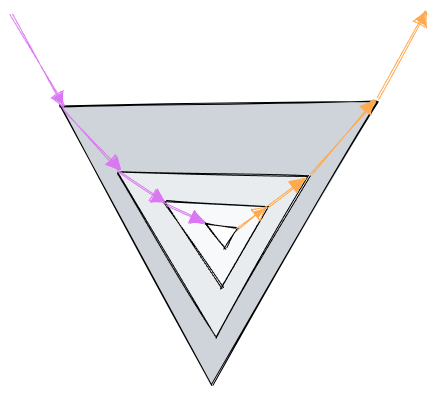

# 递归（Recursion）

## 什么是递归？

指一种通过 重复将问题**分解** 为 **同类的子问题** 而解决问题的方法。

## 如何使用递归？

**子问题** 和 **原问题** 是相似的，他们执行的代码也是相同的。子问题的计算结果返回给上一级。

- **递**：从**原问题**出发，将问题不断分解成 **规模更小**的**子问题**，直到到达递归的**边界条件**（base case），这个过程就是 **递** 过程；
- **归**：从边界条件开始返回，不断的返回给上一级，直到得出原问题的答案；

## 为什么这样计算就能得出正确答案？

数学归纳法证明

## 用来解决什么问题？

- **数据的定义是按递归定义的**：比如斐波那契数，阶乘计算；
- **问题解法按递归算法实现**：比如汉诺塔，最大公约数，二分查找；
- **数据的结构形式是按递归定义的**：比如链表、二叉树、文件系统遍历；

## 如何思考？

**不要陷入细节**，想清楚两个点：

- **边界条件**；
- 原问题 和 子问题 的**关系**；

## 时间复杂度

https://en.wikipedia.org/wiki/Master_theorem_(analysis_of_algorithms)
